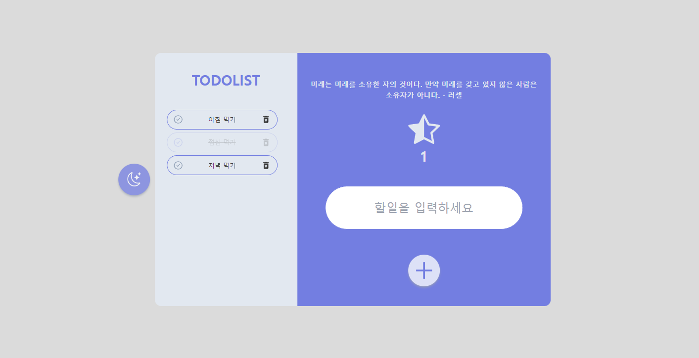
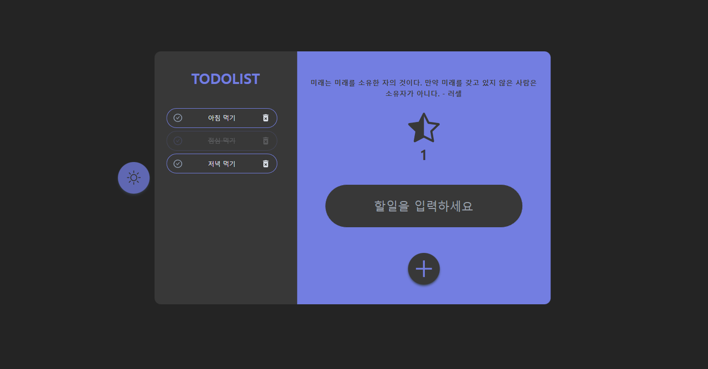

# 프로젝트 소개

간단한 투두 리스트 앱을 작성해봤습니다.

사용한 기술 스택은 다음과 같습니다.

<br>

# Stack


 

 

 

 

 

 

 


<br>
<br>

# Result



light mode 에서의 시연 화면입니다.



dark mode 에서의 시연 화면입니다.

<br>

# 주요 기능 구현

- yarn berry, vite을 이용해 프로젝트 환경을 구성했습니다.

- tailwindcss를 통하여 dark mode를 구현하였으며 이 과정에서 web api인 window.matchMedia()를 학습하여 프로젝트에 적용했습니다. 그 결과 OS에 설정된 색상모드 선호를 감지하여 사용자의 선호도에 맞는 화면을 보여주는 기능을 구현할 수 있었습니다. 또한 local storage를 통하여 한번 방문한 사용자의 다크모드 설정 여부를 기억해두도록 기능을 구현했습니다. 또한 이 과정에서 [tailwind css로 수동으로 설정할 수 있는 다크모드 만들기](https://xionwcfm.tistory.com/280) 라는 제 블로그 포스트를 참고했습니다.

- 간단한 생성, 삭제 및 darkmode 설정을 전역적으로 사용하기 위해 redux toolkit을 사용하였습니다. 규모가 작은 애플리케이션이기 때문에 prop 내려주기로도 충분할 것이라는 생각이 들었지만 확장을 용이하게하기 위해 redux toolkit을 이용했습니다.

- 완료한 일을 체크하는 Toggle과 Todo를 추가할 Insert 잘못 입력한 Todo를 지울 delete 버튼을 구현했습니다. 이 과정에서 [Redux와 Redux-toolkit](https://xionwcfm.tistory.com/251) 라는 제 포스트를 참고하며 코드를 작성했습니다.


# 문제점

여러개의 컴포넌트를 만들었지만 재사용될 수 있는 컴포넌트가 있는지를 고려해보았을때는 거의 대부분의 컴포넌트들이 재사용할 수 없는 컴포넌트였습니다.
재사용성을 좀 더 생각하면서 코드를 작성해야겠다는 생각이 들었습니다.
각각의 성격을 고려하여 hooks, components, utilComponents, module, type 등으로 타입들을 나눠주었는데 그런 와중에 고민이 생겼습니다.
예컨대 type 폴더를 만든 것은 자주 사용하게되는 타입들을 type 폴더에서 꺼내오기 위함이지만
reduxtoolkit을 구성할때 사용해야하는 타입들은 바로 reduxtoolkit에서 꺼내오게되는 점이었습니다.
그렇다고해서 reduxtoolkit이 제공해주는 타입을 export하는 파일을 만들자니 그건 너무 의미가 없는 것 같아 그냥 바로 import하여 사용했습니다.

처음에 모바일 환경을 생각하지않고 css를 디자인하다보니 모바일 환경에 대한 대응을 중간에 준비하기가 애매한 부분이 있었습니다.
이부분 역시 고려했어야할 것 같습니다.


# 회고

yarn berry를 이용해 프로젝트 환경을 구성하던 중 npm 패키지 매니저를 이용할 때에는 쉽게 가능했던 path 모듈을 이용한 alias 설정이 path 모듈을 찾을 수 없다는 오류로 인해 사용할 수 없는 문제가 있었습니다.

우선은 path 모듈을 제외하고 작업했지만 패키지 매니저에 따라 이슈가 발생할 수 있다는 것을 체감 하였고 prettier-plugin-tailwindcss가 yarnberry 환경에서 자동으로 적용이 되지 않는 이슈가 있었습니다.

이 문제의 경우 .prettierrc에 
```
  "plugins": ["prettier-plugin-tailwindcss"]
```

속성을 추가해주는 것으로 해결할 수 있었습니다.

config 파일들의 옵션을 통해 많은 문제들을 해결할 수 있다는 것이 체감되었습니다.
